    <h3 align="center">CYAK</h3>
    
Cyak is utility for create cmake project or the only target cmake list file by presets

    

        
        
        
    

## Usage

See more [examples](./example.md)

## Create your preset
If you want to add your own preset, then you need to add a directory with your preset to the .../share/cyak/presets (or any other directory where they located) presets directory. The directory name will be the name of the preset. The preset directory should include a subdirectory `templates`, where required files are stored:

| Name                | Description                                                                | Location                                   |
|---------------------|----------------------------------------------------------------------------|--------------------------------------------|
| config.template     | Configuration file for libs and interfaces. Need for use find_package(...) | project/cmake/target_name-config.cmake.in  |
| executable.template | Cmake list file for executable target                                      | project/src/target_name/CMakeLists.txt     |
| library.template    | Cmake list file for library target                                         | project/src/target_name/CMakeLists.txt     |
| interface.template  | Cmake list file for interface target                                       | project/include/target_name/CMakeLists.txt |
| project.template    | Main project cmake list file                                               | project/CMakeLists.txt                     |
| test.template       | Cmake list file for test target                                            | project/test/target_name/CMakeLists.txt    |

Also you can put any files or directories into `preset_name/asis` which will copy to the project directory as is (cmake modules for example)

Variables which you can use in `targets` cmake list files:

| Name                 | Type       | Description                                                     |
|----------------------|------------|-----------------------------------------------------------------|
| .Name                | string     | Target name                                                     |
| .Namespace           | string     | Target namespace                                                |
| .Type                | TargetType | Target type. Values: ["executable", "library", "interface"]     |
| .CxxStandard         | int        | C++ standard. Validates it during the survey [11, 14, 17, etc.] |
| .CxxExtensions       | OnOffType  | Enable of disable C++ extensions. Values: ["On", "Off"]         |
| .CxxStandardRequired | YesNoType  | Use CxxStandard as a requirement or not. Values: ["Yes", "No"]  |
| .MajorVersion        | Version    | Major version of target. Just integer                           |
| .MinorVersion        | Version    | Minor version of target. Just integer                           |
| .PatchVersion        | Version    | Patch version of target. Just integer                           |
| .CreateTest          | bool       | Needs create test for target, or no. Values: [true, false]      |

Variables which you can use in `project` cmake list file:

| Name                 | Type            | Description                                                     |
|----------------------|-----------------|-----------------------------------------------------------------|
| .Name                | string          | Target name                                                     |
| .Language            | LanguageType    | Project language. Values: ["CXX", "C"]                          |
| .CxxStandard         | int             | C++ standard. Validates it during the survey [11, 14, 17, etc.] |
| .CxxExtensions       | OnOffType       | Enable of disable C++ extensions. Values: ["On", "Off"]         |
| .CxxStandardRequired | YesNoType       | Use CxxStandard as a requirement or not. Values: ["Yes", "No"]  |
| .MajorVersion        | Version         | Major version of target. Just integer                           |
| .MinorVersion        | Version         | Minor version of target. Just integer                           |
| .PatchVersion        | Version         | Patch version of target. Just integer                           |
| .Targets             | []*TargetConfig | Array of targets configs. Structure of this you can see above   |